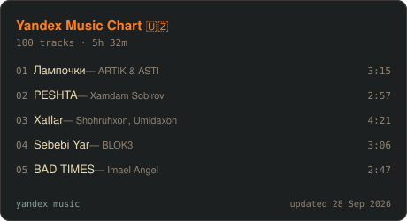
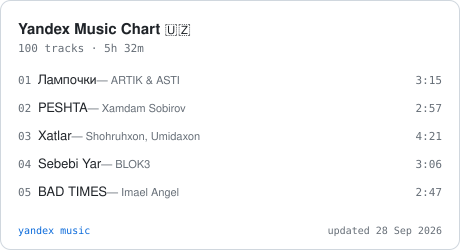
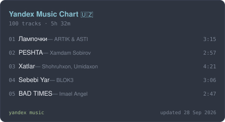

# yamu

Put your **Yandex Music** playlist on your portfolio or your GitHub profile —
fetched once at build time, committed as plain JSON and an SVG card, served
with the rest of your static files.



Nothing runs on your site at runtime. Nothing of yours is stored anywhere but
your own repository. Public playlists need **no token at all**.

---

## Why it works this way

Yandex Music has no public API, and the endpoints the web player uses reject
browser requests from other origins. So the data has to be collected somewhere
else — and a scheduled GitHub Action is the smallest "somewhere else" there is:
it runs in your repo, writes a file, commits it, and your existing deploy picks
it up.

That also means your page keeps working on the day Yandex changes something.
The worst case is a file that stops refreshing, not a page that breaks.

**There is no "now playing".** Reading the current track needs a token *and*
the queue-sync the official apps do, and a cron job that runs every few minutes
cannot honestly claim to know what you are listening to right now. What you get
instead is a playlist, your liked tracks, and the list of playlists you made —
all of which are true for as long as they are on screen.

## Quick start — a card in your profile README

No token, no account anywhere, about two minutes:

```yaml
# .github/workflows/music.yml
name: music
on:
  schedule: [{ cron: "0 */6 * * *" }]
  workflow_dispatch:
permissions:
  contents: write
jobs:
  update:
    runs-on: ubuntu-latest
    steps:
      - uses: actions/checkout@v4
      - uses: abdurahmon27/yamu@v1
        with:
          # Both come straight out of a playlist link — see "Finding your
          # user and playlist" below.
          user: "your-yandex-login"
          playlist: "1000"
          tld: "uz"        # ru | uz | com | by | kz
          card: "music.svg"
          theme: "gruvbox" # gruvbox | dark | light | nord
          cover: "true"
      - run: |
          git config user.name "github-actions[bot]"
          git config user.email "41898282+github-actions[bot]@users.noreply.github.com"
          git add music.json music.svg
          git diff --staged --quiet || git commit -m "chore: refresh music"
          git push
```

Then in your `README.md`:

```md

```

Full copies of this and a site-oriented version live in [`examples/`](./examples).

## Quick start — a portfolio site

Fetch into your repo, then render the JSON with your own components:

```bash
npx github:abdurahmon27/yamu fetch \
  --user your-login \
  --playlist 1000 \
  --tld uz \
  --limit 20 \
  --out public/music.json
```

```tsx
import music from "../public/music.json";
import { YamuPlaylist } from "yamu/react";

export function Music() {
  return <YamuPlaylist data={music} limit={8} />;
}
```

`YamuPlaylist` ships **no styles** — it renders semantic markup with `yamu-*`
class names and leaves the design to you. Or skip it entirely and map over
`music.playlist.tracks` yourself; the JSON is the real interface.

## Finding your user and playlist

Both values are already in the link to any of your playlists:

```
https://music.yandex.uz/users/your-login/playlists/1000
       └── tld ──┘      └── user ──┘     └ playlist ┘
```

To get that link:

- **Web** — open [music.yandex.com](https://music.yandex.com), go to *My
  music → Playlists* (*Моя музыка → Плейлисты*) and click the playlist. The
  address bar has it.
- **Mobile app** — open the playlist, then *Share → Copy link*
  (*Поделиться → Скопировать ссылку*).

`user` is your Yandex login; some accounts show a numeric uid there instead.
Either one works. `playlist` is the number at the end — and `3` is the special
kind for **Liked tracks**, which you can also ask for with `--likes`.

Rather not read URLs? Hand it to yamu:

```console
$ npx github:abdurahmon27/yamu url "https://music.yandex.uz/users/yamusic-top/playlists/1076"
{
  "user": "yamusic-top",
  "playlist": "1076",
  "tld": "uz"
}
```

Or skip the step entirely — pass the whole link as `--playlist` and `--user`
and `--tld` are read from it:

```bash
npx github:abdurahmon27/yamu fetch \
  --playlist "https://music.yandex.uz/users/yamusic-top/playlists/1076" \
  --out music.json
```

**The playlist has to be public** for the tokenless path: on Yandex Music open
the playlist and make sure it is not marked private. A private one needs a
token — see [Tokens](#tokens-and-when-you-do-not-need-one).

## CLI

```
yamu fetch --user <uid|login> [options]
yamu card  --in <data.json> --out <card.svg> [options]
yamu url   <music.yandex link>
```

| Flag | Meaning |
|---|---|
| `--user <uid\|login>` | Whose data to read. |
| `--playlist <kind\|url>` | Playlist to fetch — the number at the end of its URL. |
| `--playlists` | Also include the user's public playlist list. |
| `--likes` | Also include liked tracks (needs public music, or a token). |
| `--limit <n>` | Tracks kept per section. Default 20. |
| `--tld <ru\|uz\|com\|by\|kz>` | Yandex Music domain. Default `ru`. |
| `--lang <code>` | Language for titles Yandex localises. Default `en`. |
| `--token <token>` | Only for private data. Prefer a secret over typing it. |
| `--out <file>` | JSON destination. Default `yamu.json`. |
| `--card <file>` | Also render an SVG card. |
| `--theme <name>` | `gruvbox`, `dark`, `light`, `nord`. |
| `--cover` | Embed the playlist cover in the card. |
| `--width <px>` | Card width. Default 460. |
| `--title <text>` | Override the card heading. |
| `--no-footer` | Drop the "updated …" line. |
| `--soft-fail` | On a failed fetch, keep what is on disk and exit 0. |

## Action inputs

`user`, `playlist`, `playlists`, `likes`, `limit`, `tld`, `lang`, `token`,
`out`, `card`, `theme`, `title`, `width`, `cover`, `soft-fail` — the same
meanings as above. `soft-fail` defaults to `true`, so a bad day at Yandex
leaves your committed files untouched and your workflow green.

Outputs: `json` and `card`, the paths that were written.

## The JSON

```jsonc
{
  "generatedAt": "2026-09-28T09:00:00.000Z",
  "source": "yandex-music",
  "tld": "uz",
  "playlist": {
    "uid": "414787002",
    "kind": "1076",
    "title": "Yandex Music Chart",
    "url": "https://music.yandex.uz/users/yamusic-top/playlists/1076",
    "cover": "https://avatars.yandex.net/…/400x400",
    "trackCount": 100,
    "durationMs": 19920000,
    "modified": "2026-09-28T08:38:04+00:00",
    "tracks": [
      {
        "id": "79071659",
        "title": "Лампочки",
        "artists": "ARTIK & ASTI",
        "artistList": [{ "id": "218547", "name": "ARTIK & ASTI" }],
        "album": { "id": "16969949", "title": "Миллениум X" },
        "durationMs": 195780,
        "url": "https://music.yandex.uz/album/16969949/track/79071659",
        "cover": "https://avatars.yandex.net/…/400x400"
      }
    ]
  },
  "likes": { "count": 412, "tracks": [] },
  "playlists": []
}
```

Fields are only present when you asked for them. Anything yamu could not read
comes back `null` rather than missing, so your template never has to guess.

## Themes

| gruvbox | light | nord |
|---|---|---|
|  |  |  |

The card is deliberately plain: no scripts, no external images, no CSS — GitHub
strips all three from README images. The cover, when you ask for it, is
embedded in the file.

## Tokens, and when you do not need one

You do **not** need a token for a public playlist, a public playlist list, or
likes on a profile whose music is public. Start there.

If you do need one, keep three things in mind:

1. A Yandex OAuth token is not a music key — it is your **Yandex ID**: mail,
   Disk, and everything else on the account. Treat it accordingly.
2. Put it in **your own** repository's secrets (`Settings → Secrets and
   variables → Actions`) and pass it as `token: ${{ secrets.YANDEX_MUSIC_TOKEN }}`.
   yamu never writes it into the JSON, the card or the logs.
3. Revoke it the moment you stop using it, from your Yandex account's
   connected-apps page. Rotating is cheap; regretting is not.

Because everything runs in your repository, there is no service here that could
lose your token — including this one.

## When Yandex changes something

It will. Every call lives in a single file (`src/api.ts`) and every mapping in
another (`src/normalize.ts`), pinned by fixtures captured from real responses.
Fixing a break is usually a few lines plus an updated fixture —
[CONTRIBUTING.md](./CONTRIBUTING.md) walks through it, and pull requests are
welcome.

## Development

```sh
npm install
npm run build   # dist/ is committed — the GitHub Action runs from it
npm test
```

## Not affiliated with Yandex

An independent, unofficial project by fans of the service. It reads the same
public endpoints the web player already calls, at the request of the person who
owns the data. "Yandex" and "Yandex Music" belong to their owners. Use it for
your own account, and check Yandex Music's terms of use before you do anything
clever with it.

MIT © Abdurahmon Mamadiyorov
